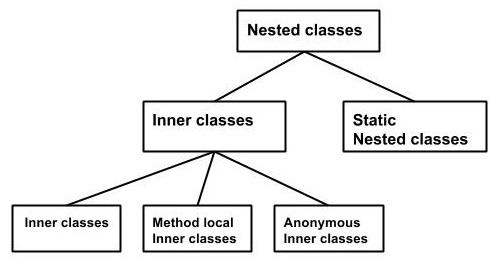

# Java

## Inner Classes
Nested classes are divided into two types:

* **Non-static nested classes** − These are the non-static members of a class.
* **Static nested classes** − These are the static members of a class



### Inner Classes (Non-static Nested Classes)

Inner classes are a security mechanism in Java. We know a class cannot be associated with the access modifier private, but if we have the class as a member of other class, then the inner class can be made private. And this is also used to access the private members of a class.

Inner classes are of three types depending on how and where you define them. They are:

* Inner Class
* Method-local Inner Class
* Anonymous Inner Class

#### Inner Class

Creating an **inner** class is quite simple. You just need to write a class within a class. Unlike a class, an inner class can be private and once you declare an inner class private, it cannot be accessed from an object outside the class.

```java
class Outer_Demo {
   // private variable of the outer class
   private int num = 175;  
   
   // inner class
   public class Inner_Demo {
      public int getNum() {
         System.out.println("This is the getnum method of the inner class");
         return num;
      }
   }
}

public class My_class2 {
   public static void main(String args[]) {
      // Instantiating the outer class
      Outer_Demo outer = new Outer_Demo();
      
      // Instantiating the inner class
      Outer_Demo.Inner_Demo inner = outer.new Inner_Demo();
      System.out.println(inner.getNum());
   }
}
```

```
Output

This is the getnum method of the inner class: 175
```

#### Method-local Inner Class

In Java, we can write a class within a method and this will be a local type. Like local variables, the scope of the inner class is restricted within the method.

```java
public class Outerclass {
   // instance method of the outer class 
   void my_Method() {
      int num = 23;

      // method-local inner class
      class MethodInner_Demo {
         public void print() {
            System.out.println("This is method inner class "+num);	   
         }   
      } // end of inner class
	   
      // Accessing the inner class
      MethodInner_Demo inner = new MethodInner_Demo();
      inner.print();
   }
   
   public static void main(String args[]) {
      Outerclass outer = new Outerclass();
      outer.my_Method();	   	   
   }
}
```

```
Output

This is method inner class 23
```

#### Anonymous Inner Class

An inner class declared without a class name is known as an anonymous inner class. In case of anonymous inner classes, we declare and instantiate them at the same time. Generally, they are used whenever you need to override the method of a class or an interface.

```java
abstract class AnonymousInner {
   public abstract void mymethod();
}

public class Outer_class {

   public static void main(String args[]) {
      AnonymousInner inner = new AnonymousInner() {
         public void mymethod() {
            System.out.println("This is an example of anonymous inner class");
         }
      };
      inner.mymethod();	
   }
}
```

```
Output

This is an example of anonymous inner class
```

***Explanation on how this abstract fuckery actually works***
https://stackoverflow.com/questions/55045572/instantiation-of-abstract-classes 


### Static Nested Class

A static inner class is a nested class which is a static member of the outer class. It can be accessed without instantiating the outer class, using other static members. Just like static members, a static nested class does not have access to the instance variables and methods of the outer class.

```java
public class Outer {
   static class Nested_Demo {
      public void my_method() {
         System.out.println("This is my nested class");
      }
   }
   
   public static void main(String args[]) {
      Outer.Nested_Demo nested = new Outer.Nested_Demo();	 
      nested.my_method();
   }
}
```

---
* The four Java principles
* Autoboxing and Unboxing